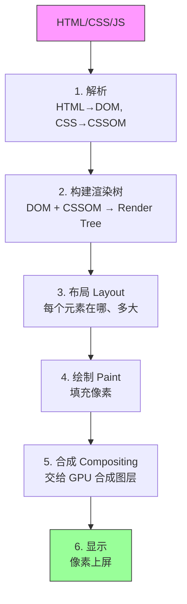

# 浏览器渲染管线：从 HTML 到像素，中间发生了什么"

> 很多人优化性能是"试出来的"——加 `will-change`、减 DOM、用 `requestAnimationFrame`。但不知道管线，就不知道**为什么**这么做有用。

---

## 管线全景

**关键认知**：每一步都可能触发**重做后面所有步骤**。性能优化的本质就是**减少管线被重新执行的次数**。

---

## 为什么会重绘 / 重排

| 操作 | 触发什么 | 代价 |
|------|----------|------|
| 改 `width/height/margin` | **重排 + 重绘** | 全管线重跑 |
| 改 `color/background` | **重绘**（不重排） | 跳过 Layout |
| 改 `transform/opacity` | **只合成**（不重绘） | 最快 |

**这就是为什么 `transform` 做动画比改 `left` 快**——它跳过了 Layout 和 Paint，直接到 Compositing。

---

## 认知升华

回头看，渲染管线教给我们的是：

> **优化的方向，不是"加什么"，而是"少触发什么"。**

- 不知道管线 → 试各种优化手段，不知道哪个有效
- 知道管线 → 一看代码就知道会触发哪几步，精准优化

---

## 验证你有没有想清楚

两个问题：

1. 为什么 `document.fragment` 能减少重排？它本质是减少了管线的哪一步？
2. `requestAnimationFrame` 和 `requestIdleCallback`，分别插在管线的哪个位置？为什么动画要用前者？

（答案同样不写在这里——去想清楚，想清楚了才是你的认知。）
