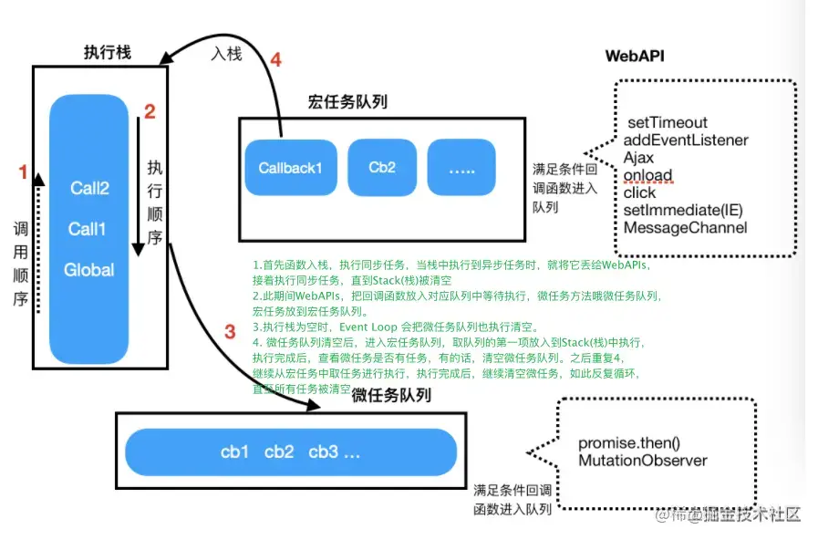
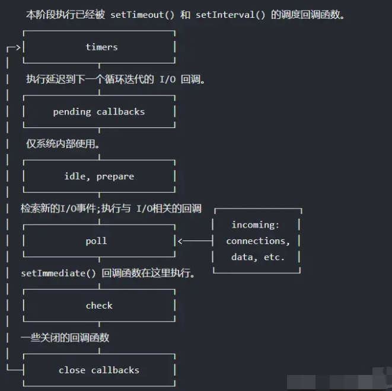

# JavaScript 基础

## 事件

### 事件产生与事件流

由用户操作 web 页面的行为触发，事件发生时会在元素节点与根节点之间按照特定的顺序传播，路径所经过的所有节点都会收到该事件，这个传播过程即 DOM 事件流。<br>

### 事件流的三个阶段

- 捕获阶段：事件对象从目标的祖先节点 Window 开始传播直至目标。
- 目标阶段：事件对象传递到事件目标。如果事件的 type 属性表明后面不会进行冒泡操作，那么事件到此就结束了。
- 冒泡阶段：事件对象以一个相反的方向进行传递，从目标开始，到 Window 对象结束。

**事件冒泡** 事件按照从最特定的事件目标到最不特定的事件目标(document 对象)的顺序触发。
**事件捕获** 事件按照从最不特定的事件目标到最特定的事件目标(document 对象)的顺序。

```
<!DOCTYPE html>
<html>
    <head>
        <meta charset="UTF-8">
        <title></title>
        <style type="text/css">
            #outer{
                width: 200px;
                height: 200px;
                background: red;
            }
            #inner{
                width: 100px;
                height: 100px;
                background: blue;
            }
        </style>
    </head>
    <body>
        <div id="outer">
            <div id="inner"></div>
        </div>
        <script type="text/javascript">
            var outer = document.getElementById("outer");
            var inner = document.getElementById("inner");
            document.onclick = function(){
                console.log("document");
            }
            inner.onclick = function(e){
                var evt = e || event;
                console.log("inner");
            }
            outer.onclick = function(e){
                var evt = e || event;
                console.log("outer");
            }
        </script>
    </body>
</html>

```

**阻止事件冒泡** 不同浏览器对阻止冒泡的写法存在兼容问题,在 ie 浏览器中阻止冒泡的方法是 window.event.cancelBubble=true 而在谷歌,火狐等浏览器的方法则是 e.stopPropagation()
阻止事件在 DOM 中继续传播，即取消进一步的事件捕获或冒泡，防止再触发定义在别的节点上的监听函数，但是不包括在当前节点上新定义的事件监听函数。

```
outer.onclick = function(e){
    var evt = e || event;
    console.log("outer");
    if(evt.stopPropagation){
        evt.stopPropagation();
    }else{
        evt.cancelBubble = true;
    }
}
```

### 事件委托

利用事件冒泡的特性，将里层的事件委托给外层事件，根据 event 对象的属性进行事件委托，改善性能。
使用事件委托能够避免对特定的每个节点添加事件监听器；事件监听器是被添加到它们的父元素上。事件监听器会分析从子元素冒泡上来的事件，找到是哪个子元素的事件。
举个例子，点击更多添加 li,且点击每个 li 都输出 aa,点击其他地方不显示。

_参考资料：https://www.jianshu.com/p/38997c83b017_

## 框架

### 写 React/Vue 项目时为什么要在列表组件中写 key？作用是什么？

答：Vue 和 React 都是采用 diff 算法来对比新旧虚拟节点，从而更新节点。key 是给每一个 vnode 的唯一 id,可以依靠 key，更准确，更快的拿到 oldVnode 中对应的 vnode 节点。

- 更准确
  避免就地复用，在 sameNode 函数 a.key === b.key 对比可以避免就地复用的情况，所以会更加准确。
- 更快
  利用 key 的唯一性生成 map 对象来获取对应节点，比遍历方式更快。

### Vue3 和 Vue2 相比有哪些新特性？

静态提升、靶向更新。
虽然，对于面试常问的 diff 过程在一定程度上是减少了对 DOM 的直接操作。但是，这个减少是有一定成本的。因为，如果是复杂应用，那么就会存在父子关系非常复杂的 VNode，而这也就是 diff 的痛点，它会不断地递归调用 patchVNode，不断堆叠而成的几毫秒，最终就会造成 VNode 更新缓慢。
也因此，这也是为什么我们所看到的大型应用诸如阿里云之类的采用的是基于「React」的技术栈的原因之一。所以，「Vue3」也是痛改前非，重写了整个 Compiler 过程，提出了静态提升、靶向更新等优化点，来提高 patchVNode 过程。

静态更新：在 Vue3 中使用了静态提升后，对于不参与更新的元素，只会被创建一次，在渲染时直接复用即可

## EventLoop 事件循环

JS 是单线程的，为了防止一个函数执行时间过长阻塞后面的代码，所以会先将同步代码压入执行栈中，依次执行，将异步代码推入异步队列，异步队列又分为宏任务队列和微任务队列，因为宏任务队列的执行时间较长，所以微任务队列要优先于宏任务队列。微任务队列的代表就是，Promise.then，MutationObserver，宏任务的话就是 setImmediate setTimeout setInterval

JS 运行的环境。一般为浏览器或者 Node。 在浏览器环境中，有 JS 引擎线程和渲染线程，且两个线程互斥。 Node 环境中，只有 JS 线程。 不同环境执行机制有差异，不同任务进入不同 Event Queue 队列。 当主程结束，先执行准备好微任务，然后再执行准备好的宏任务，一个轮询结束。

### 浏览器中的事件环 Event Loop

事件环的运行机制是，先会执行栈中的内容，栈中的内容执行后执行微任务，微任务清空后再执行宏任务，先取出一个宏任务，再去执行微任务，然后在取宏任务清微任务这样不停的循环。

eventLoop 是由 JS 的宿主环境（浏览器）来实现的；事件循环可以简单的描述为以下四个步骤:

1. 函数入栈，当 Stack 中执行到异步任务的时候，就将他丢给 WebAPIs,接着执行同步任务,直到 Stack 为空；

2. 此期间 WebAPIs 完成这个事件，把回调函数放入队列中等待执行（微任务放到微任务队列，宏任务放到宏任务队列）

3. 执行栈为空时，Event Loop 把微任务队列执行清空；

4. 微任务队列清空后，进入宏任务队列，取队列的第一项任务放入 Stack 中执行，执行完成后，查看微任务队列是否有任务，有的话，清空微任务队列。重复 4，继续从宏任务中取任务执行，执行完成之后，继续清空微任务，如此反复循环，直至清空所有的任务。



浏览器中的任务源(task):

1. 宏任务(macrotask)：宿主环境提供的，比如浏览器、ajax、setTimeout、setInterval、setTmmediate(只兼容 ie)、script、requestAnimationFrame、messageChannel、UI 渲染、一些浏览器 api
2. 微任务(microtask)：语言本身提供的，比如 promise.then、then、queueMicrotask(基于 then)、mutationObserver(浏览器提供)、messageChannel 、mutationObersve

### Node 环境中的事件环 Event Loop

Node 是基于 V8 引擎的运行在服务端的 JavaScript 运行环境，在处理高并发、I/O 密集(文件操作、网络操作、数据库操作等)场景有明显的优势。虽然用到也是 V8 引擎，但由于服务目的和环境不同，导致了它的 API 与原生 JS 有些区别，其 Event Loop 还要处理一些 I/O，比如新的网络连接等，所以 Node 的 Event Loop(事件环机制)与浏览器的是不太一样。



执行顺序如下：

1. timers: 计时器，执行 setTimeout 和 setInterval 的回调

2. pending callbacks: 执行延迟到下一个循环迭代的 I/O 回调

3. idle, prepare: 队列的移动，仅系统内部使用

4. poll 轮询: 检索新的 I/O 事件;执行与 I/O 相关的回调。事实上除了其他几个阶段处理的事情，其他几乎所有的异步都在这个阶段处理。

5. check: 执行 setImmediate 回调，setImmediate 在这里执行

6. close callbacks: 执行 close 事件的 callback，一些关闭的回调函数，如：socket.on('close', ...)
